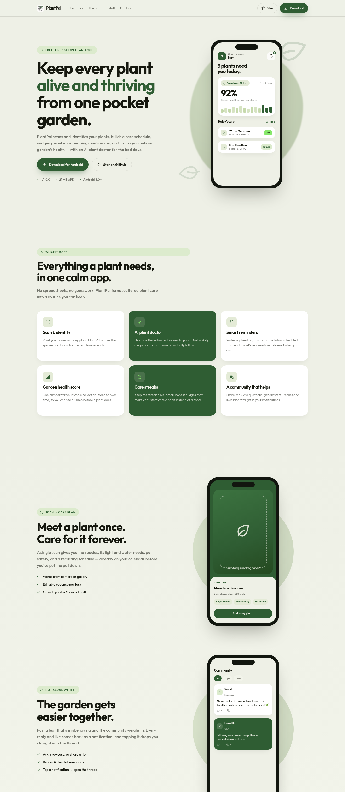

<div align="center">


# PlantPal — Landing Page

**The download page for [PlantPal](https://github.com/Natnsis/plant_pal_app)** — a free,
open-source Android app that scans your plants, schedules their care, and nudges you
before anything wilts.


[**Live site**](#deploy) · [**Get the app →**](https://github.com/Natnsis/plant_pal_app/releases/latest)



</div>

---

## What this repo is

A single-page marketing site that:

- **hands users the APK** and walks them through installing it — including the
  Play Protect "Install anyway" step that trips people up,
- **shows off the app** with hand-built CSS phone mockups (no screenshots to keep stale),
- **sends stars** to the [app repo](https://github.com/Natnsis/plant_pal_app).

It's a static site — every route is prerendered to plain HTML/CSS/JS. No server, no
database, nothing to run in production.

## Design

Colours, type and radii are lifted straight from the app's theme
(`plant_app/lib/theme/pp_theme.dart`) so the site and the app feel like one product:
forest green, bone, lime accent, the **Outfit** typeface, generously rounded cards.

## Tech

| | |
|---|---|
| Framework | SvelteKit 2 · Svelte 5 (runes) |
| Adapter | `@sveltejs/adapter-static` — prerendered |
| Fonts | self-hosted `@fontsource-variable/outfit` |
| Icons | inline SVG, ~1 KB (`src/lib/components/Icon.svelte`) |
| Deps at runtime | none |

## Quick start

```bash
npm install
npm run dev        # http://localhost:5173
npm run check      # type + a11y check
npm run build      # → build/
npm run preview    # serve the production build
```

## Project map

| Path | What |
|---|---|
| `src/routes/+page.svelte` | page assembly + `<head>` / SEO |
| `src/lib/components/` | one component per section — `Hero`, `Features`, `Showcase`, `Install`, `OpenSource`, `Footer` |
| `src/lib/components/Phone*.svelte` | CSS recreations of app screens |
| `src/lib/config.ts` | **the only file you edit per release** — repo URL, APK link, version strings |
| `src/app.css` | design tokens + shared button / layout classes |
| `static/icon.jpg`, `favicon.*` | app icon, reused as logo + favicons |

## Cutting a new app release

The download buttons resolve to the latest GitHub release:

```
https://github.com/Natnsis/plant_pal_app/releases/latest/download/PlantPal.apk
```

`releases/latest/download/<asset>` always points at the newest release, so the link
never changes — **keep the uploaded asset named `PlantPal.apk`**. Then:

```bash
cd ../plant_app
flutter build apk --release
cp build/app/outputs/flutter-apk/app-release.apk PlantPal.apk
# → attach PlantPal.apk to a new release on Natnsis/plant_pal_app
```

Bump `APP_VERSION` / `APK_SIZE` in `src/lib/config.ts` to match.

## Deploy

`npm run build` writes a self-contained static site to `build/`.

- **Vercel** — `vercel.json` in the repo sets `framework: null` + `outputDirectory: build`,
  so it deploys as a plain static site (no SvelteKit preset, no functions). Just import
  the repo.
- **Netlify / Cloudflare Pages** — build `npm run build`, publish `build/`.
- **GitHub Pages** — set a base path in `svelte.config.js`
  (`kit.paths.base = process.env.BASE_PATH ?? ''`), then
  `BASE_PATH=/<repo> npm run build` and publish `build/`. `static/.nojekyll` is already there.

The APK is served from GitHub Releases, so the deployed site stays a few hundred KB.

<div align="center"><sub>Part of the PlantPal project · <a href="https://github.com/Natnsis/plant_pal_app">the app lives here</a></sub></div>
